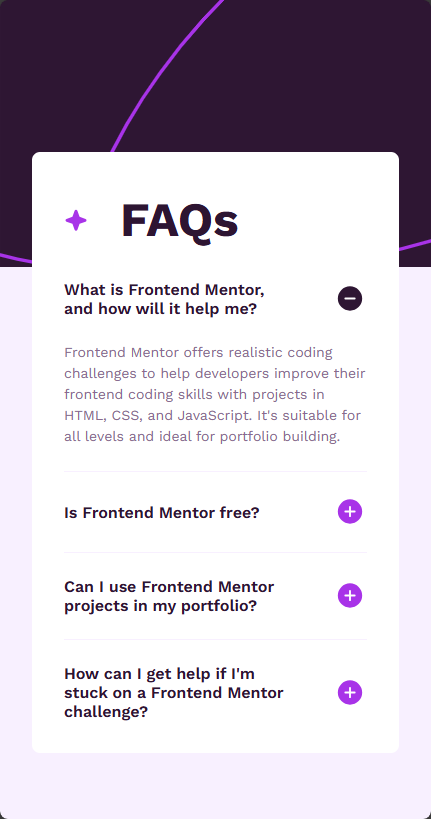

# Frontend Mentor - FAQ accordion solution

This is a solution to the [FAQ accordion challenge on Frontend Mentor](https://www.frontendmentor.io/challenges/faq-accordion-wyfFdeBwBz). Frontend Mentor challenges help you improve your coding skills by building realistic projects. 

## Table of contents

- [Frontend Mentor - FAQ accordion solution](#frontend-mentor---faq-accordion-solution)
  - [Table of contents](#table-of-contents)
  - [Overview](#overview)
    - [The challenge](#the-challenge)
    - [Screenshot](#screenshot)
    - [Links](#links)
  - [My process](#my-process)
    - [Built with](#built-with)
    - [Useful resources](#useful-resources)
  - [Author](#author)

## Overview

### The challenge

Users should be able to:

- Hide/Show the answer to a question when the question is clicked
- Navigate the questions and hide/show answers using keyboard navigation alone
- View the optimal layout for the interface depending on their device's screen size
- See hover and focus states for all interactive elements on the page

### Screenshot

### Links

- Solution URL: [FAQ Accordion in Frontend Mentor](https://www.frontendmentor.io/solutions/responsive-faq-accordion-using-css-grid-and-flexbox-yWb1UxsIRF)
- Live Site URL: [FAQ Accordion in Github Pages](https://jeluxe.github.io/FAQ-Accordion/)

## My process

### Built with

- Semantic HTML5 markup
- CSS custom properties
- Flexbox
- CSS Grid
- Mobile-first workflow
- CSS Transitions

### Useful resources

- [This video](https://www.youtube.com/watch?v=vmDEHAzj2XE) helped me for making my transition works.

## Author

- Frontend Mentor - [@Jeluxe](https://www.frontendmentor.io/profile/Jeluxe)